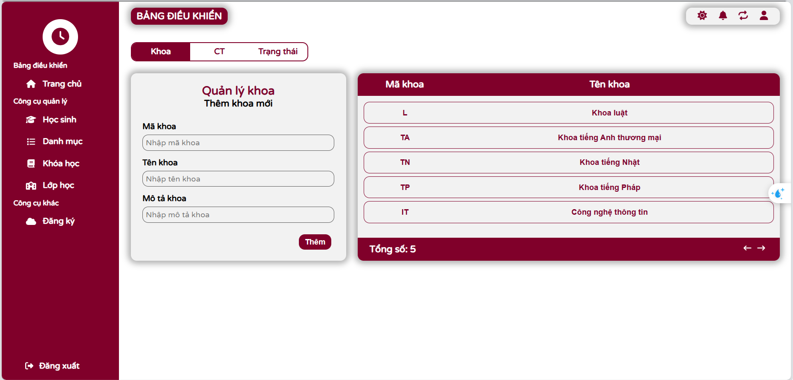
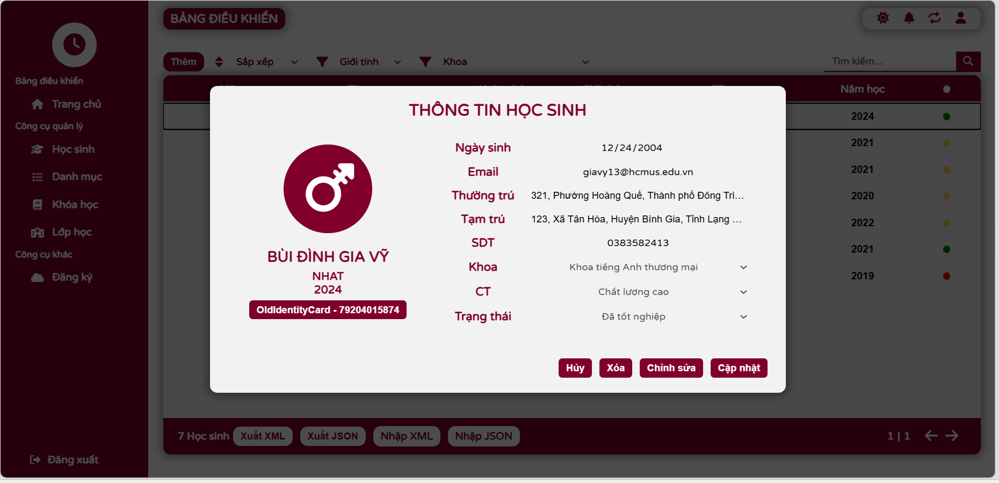
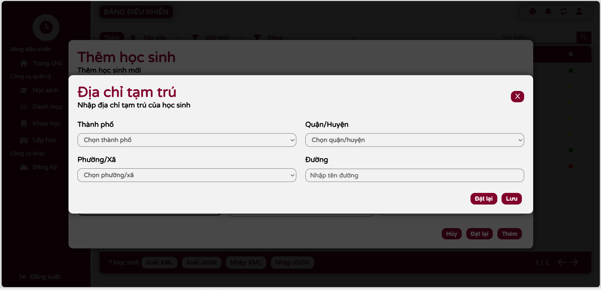
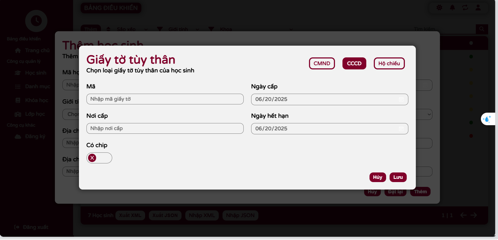
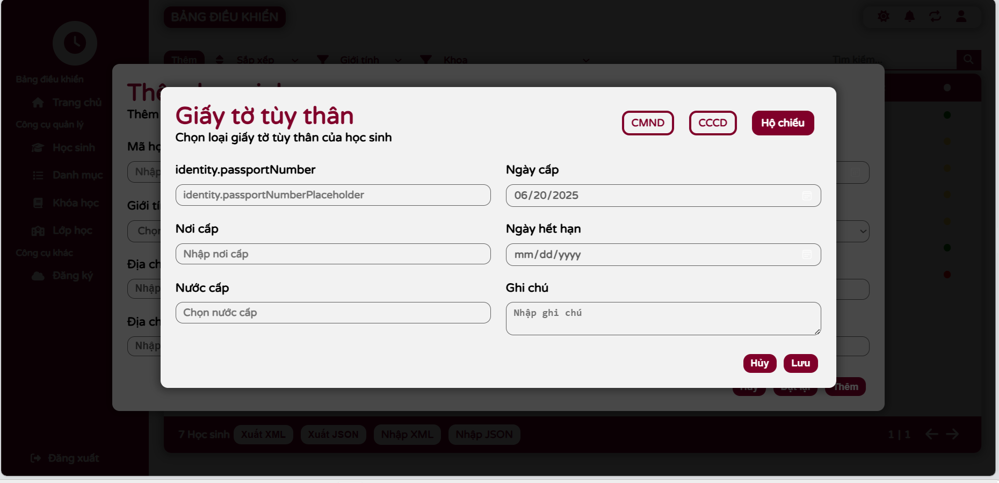
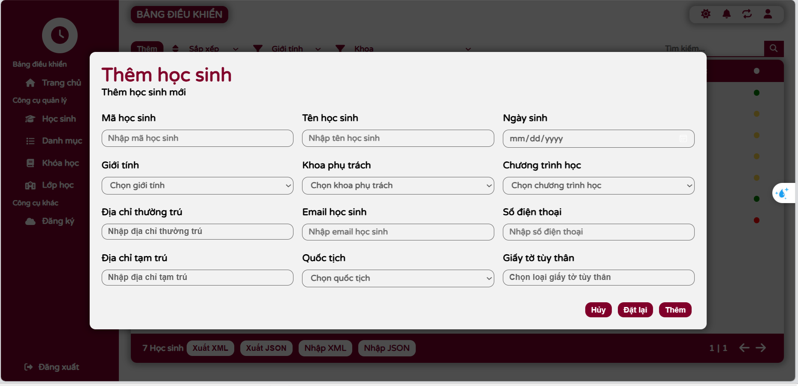
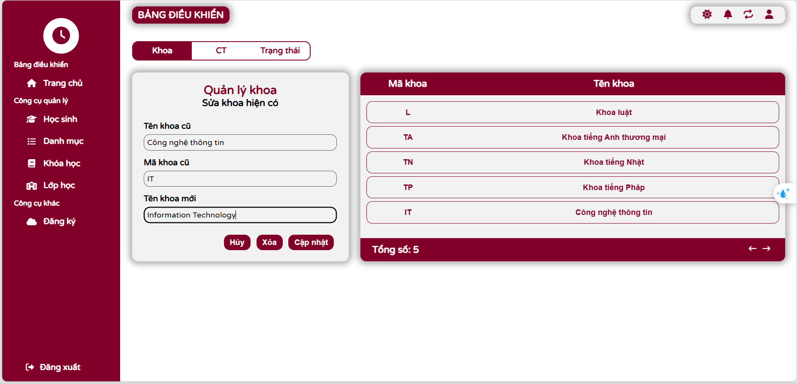

# Project Name: Ex01_CQ
Dự án này là một web app được phát triển bằng React nhằm quản lý danh sách sinh viên. Ứng dụng cho phép người dùng xem, chỉnh sửa, thêm mới và xóa thông tin sinh viên một cách dễ dàng.

## Cấu trúc source code
```
.
├── backend
│   ├── components
│   │   └── student-managing
│   │       ├── domain
│   │       │   ├── import-export
│   │       │   │   └── impl
│   │       │   ├── management
│   │       │   │   └── StudentManager.early.test
│   │       │   └── services
│   │       │       └── impl
│   │       ├── entry-points
│   │       │   └── api
│   │       │       ├── import-export
│   │       │       │   └── test
│   │       │       └── student-management
│   │       │           └── test
│   │       └── storage
│   ├── core
│   │   ├── logger
│   │   ├── responses
│   │   ├── socket
│   │   └── stream
│   ├── libraries
│   │   ├── errorHandler
│   │   ├── utils
│   │   └── validator
│   └── static-content
└── frontend
    ├── src
    │   ├── components
    │   │   ├── Content
    │   │   ├── Header
    │   │   ├── Loading
    │   │   ├── NothingDisplay
    │   │   ├── Notification
    │   │   └── SubHeader
    │   ├── contexts
    │   ├── pages
    │   │   ├── Category
    │   │   │   ├── Faculty
    │   │   │   ├── Management
    │   │   │   ├── Programs
    │   │   │   ├── Status
    │   │   │   └── styles
    │   │   ├── Home
    │   │   └── Student
    │   │       ├── Form
    │   │       │   ├── StudentAddress
    │   │       │   ├── StudentIdentity
    │   │       │   └── StudentImportForm
    │   │       ├── StudentItem
    │   │       └── StudentList
    │   ├── services
    │   └── styles
    └── test
```

## Hướng dẫn cài đặt & chạy chương trình
### Yêu cầu hệ thống
Node.js (>= 16)
npm

### Cài đặt
Chạy lệnh:```npm i``` ở cả thư mục gốc (root) và thư mục frontend

### Build chương trình
Chạy lệnh:```npm run build```

### Chạy chương trình (development mode)
Chạy lệnh:```npm run dev``` để vào dev mode, mở browser địa chỉ: 'http://localhost:5173'

### Chạy chương trình (deployment mode)
Chạy lệnh:```npm start``` để vào deployment mode, mở browser địa chỉ: 'http://localhost:3000'


## Hướng dẫn sử dụng **Version 2.0**
### Các thành phần của ứng dụng
#### Các trang
   1. **Trang chủ**
   
   

   2. **Trang hiển thị danh sách học sinh**
    
    - Khi không có học sinh nào trong danh sách
  
   

    - Khi có học sinh trong danh sách
  
   
    
   3. **Trang thêm học sinh mới**

   

     4. **Trang quản lý các danh mục liên quan**

        - Quản lý Khoa
  
            - Khi muốn thêm Khoa mới
        
            

            - Khi muốn thêm Khoa mới
        
            

        - Quản lý chương trình đào tạo
  
            - Khi muốn thêm Chương trình đào tạo mới
        
            

            - Khi muốn chỉnh sửa Chương trình đào tạo đã chọn
        
            

        - Quản lý tình trạng học sinh
      
            - Khi muốn thêm Tình trạng học sinh mới
        
            

            - Khi muốn chỉnh sửa Tình trạng học sinh đã chọn
        
            

#### Các overlay
   1. **Overlay hiển thị thông tin chi tiết một sinh viên cụ thể (Bấm chọn vào học sinh cụ thể trong danh sách học sinh)**
    
   

   2. **Overlay nhập thông tin địa chỉ**

    - Địa chỉ thường trú
    
   

    - Địa chỉ tạm trú
    
   

   3. **Overlay nhập thông tin địa chỉ**

    - Chứng minh nhân dân (CMND)
    
   

    - Căn cước công dân (CCCD)
    
   

    - Hộ chiếu (Passport)
    
   

### Hướng dẫn sử dụng các tính năng
#### Thêm học sinh với các thông tin chi tiết
   1. **Thêm thông tin địa chỉ**

    - B1: Chọn mục Địa chỉ thường trú (Địa chỉ tạm trú) bằng cách click vào phần Permanent Address (Temporary Address) tại biểu mẫu thêm học sinh để mở Overlay thông tin địa chỉ
    - B2: Chọn lần lượt từ tỉnh/thành phố -> quận/huyện -> phường/xã, sau đó nhập thông tin về tên đường, số nhà, ... tại Overlay thông tin địa chỉ
    - B3: Bấm nút Save để lưu lại thông tin vừa nhập
    
   

   2. **Thêm thông tin định danh học sinh**
   
    - B1: Chọn mục Thông tin định danh bằng cách click vào phần Identity tại biểu mẫu thêm học sinh để mở Overlay thông tin định danh
    - B2: Chọn loại định danh muốn sử dụng gồm: CMND (Old Identity), CCCD (New Identity) hoặc Hộ chiếu (Passport) để thực hiện nhập thông tin
    - B3: Nhập các thông tin cần thiết để thực hiện cung cấp thông tin định danh
    - B4: Bấm nút Save để lưu lại thông tin vừa nhập
    
   

   3. **Thêm thông tin định danh học sinh**

    - B1: Nhập/Chọn các thông tin cần thiết
    - B2: Thực hiện thêm thông tin địa chỉ và thông tin định danh như trên
    - B3: Bấm nút Add để thực hiện thêm thông tin học sinh mới
    
   

#### Thay đổi thông tin học sinh
- B1: Chọn học sinh cần chỉnh sửa thông tin tại trang hiển thị danh sách học sinh
- B2: Bấm nút Edit để tiến hành chỉnh sửa tất cả thông tin (Nếu không bấm Edit thì sẽ không chỉnh sửa được)
- B3: Chỉnh sửa các thông tin cần thiết
- B4: Bấm nút Save để thực hiện lưu thông tin đã thay đổi
    
   

#### Quản lý các danh mục (Khoa, chương trình đào tạo, tình trạng học sinh)
   1. **Thêm danh mục**

    - B1: Chọn danh mục cần thêm trên thanh điều hướng gồm Khoa (Faculty), Chương trình đào tạo (Program), Tình trạng học sinh (Status)
    - B2: Nhập tên cần thêm (VD thêm Khoa CNTT trong danh mục quản lý Khoa)
    - B3: Bấm nút Add để thực hiện thêm khoa mới
    
   

   2. **Chỉnh sửa danh mục**

    - B1: Chọn phần tử trong danh mục cụ thể (VD chọn danh mục Khoa và phần tử là Khoa CNTT)
    - B2: Nhập tên sau khi thay đổi (VD nhập Khoa Công nghệ thông tin)
    - B3: Bấm nút Save để thực hiện lưu thay đổi
    
   

#### Tìm kiếm thông tin sinh viên theo tên + khoa
   - B1: Chọn khoa cần tìm kiếm trên thanh bộ lọc (mục Faculty) -> Lọc ra các học sinh thuôc khoa đã chọn
   - B2: Nhập tên sinh viên trên thanh tìm kiếm
   - B3: Bấm vào icon tìm kiếm để thực hiện tìm kiếm